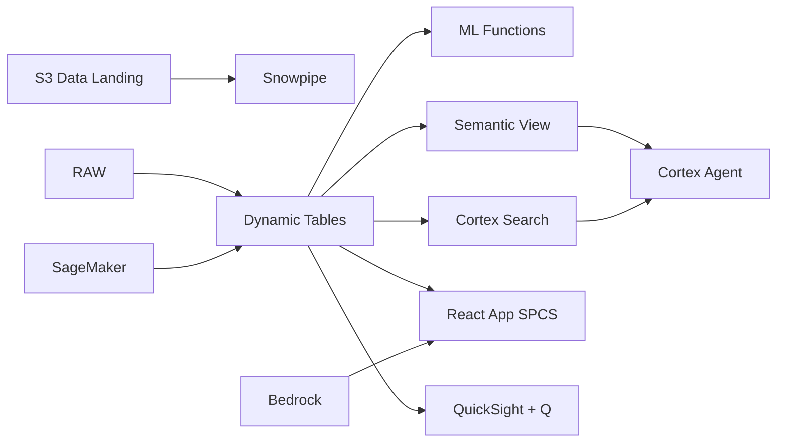

# Takaful Insurance Analytics

Claims analytics and actuarial intelligence for Indonesia's Takaful insurance market — ML.FORECAST projects claims reserves, Dynamic Tables build real-time underwriting dashboards, and Cortex AI generates risk assessments.

## Architecture

Indonesia's Takaful insurance market is growing at 15% annually, but operators face rising claims frequency and sophisticated fraud attempts. A Chief Actuary managing Rp 8.5 trillion in contributions needs real-time claims visibility, ML-powered reserve projections, and AI-driven fraud detection — while ensuring surplus distribution to participants meets Shariah principles.



## Snowflake Capabilities

| Capability | Implementation |
|-----------|---------------|
| Dynamic Tables | CLAIMS_DASHBOARD / COMBINED_RATIO / IBNR_RESERVE / FRAUD_RISK_SCORE |
| ML Functions | ML.FORECAST + ML.ANOMALY_DETECTION |
| Cortex AI | COMPLETE, SUMMARIZE, AI_CLASSIFY |
| Cortex Search | 100 documents indexed |
| Cortex Agent | TAKAFUL_INTELLIGENCE_AGENT |
| Semantic View | TAKAFUL_ANALYTICS |
| React App (SPCS) | 5 tabs + DemoGuide |


## AWS Services

| Service | Role in Demo |
|---------|-------------|
| Amazon S3 | Store claims documents, photos, and investigation files |
| Amazon SageMaker | Claims fraud detection and reserve prediction models |
| AWS Glue | ETL for claims and policy data integration |
| Amazon Rekognition | Image analysis for claims photo verification |
| Amazon Bedrock (Claude) | Generate underwriting assessments and claims narratives |
| Amazon QuickSight + Q | Actuarial dashboard with natural language queries |


## Personas

| Persona | Role | Key Questions |
|---------|------|---------------|
| **Ir. Wahyu Hidayat** | Chief Actuary | "What's our projected IBNR reserve?" "What's the combined ratio by product line?" |
| **Siti Rahayu** | Claims Manager | "Which claims are flagged for fraud investigation?" "Show me the claims development triangle for motor Takaful." |


## Data

| Table | Rows | Description |
|-------|------|-------------|
| POLICIES | 200,000 | Active Takaful policies across general, family, and health lines |
| CLAIMS | 80,000 | Claims records with status, reserve, and settlement data |
| CONTRIBUTIONS | 500,000 | Monthly contribution (premium) payments by policy and participant |
| UNDERWRITING_DOCS | 100 | Underwriting guidelines, risk assessment templates, and retakaful treaties |
| ACTUARIAL_STUDIES | 50 | Actuarial reserving studies, experience analysis, and surplus distribution reports |
| FRAUD_INDICATORS | 20,000 | Claims fraud indicators and investigation records |


## Build Instructions

### Prerequisites
- Snowflake account with ACCOUNTADMIN access
- Cortex AI enabled (ML Functions, Search, Agent)
- Warehouse: TAKAFUL_WH (Medium)
- AWS CLI with access (us-west-2)

### Deployment

```bash
snowsql -f snowflake/00_setup.sql
snowsql -f snowflake/01_marketplace_install.sql
snowsql -f snowflake/02_raw_tables.sql
snowsql -f snowflake/03_staging.sql
snowsql -f snowflake/04_dynamic_tables.sql
snowsql -f snowflake/05_search.sql
snowsql -f snowflake/06_ml_models.sql
snowsql -f snowflake/07_semantic_view.sql
snowsql -f snowflake/08_agent.sql
```

### React App (SPCS)
```bash
cd app && npm ci && npm run build
docker build -t aws-indonesia-islamic-finance-takaful-app .
docker push bdiqc8sm-default.registry.snowflakecomputing.com/takaful_analytics/app/aws_indonesia_islamic_finance_takaful/app:latest
```

### Demo Mode
Open the app URL with `?demo=true` for presenter view.

## Build Modes

### Snowflake Only
Run scripts 00-08 (skip AWS-specific integration). Uses:
- **Snowflake Internal Stage** instead of Amazon S3
- **ML.FORECAST + ML.ANOMALY_DETECTION** instead of Amazon SageMaker
- **Dynamic Tables** instead of AWS Glue
- **Cortex AI (image analysis)** instead of Amazon Rekognition
- **Cortex Complete** instead of Amazon Bedrock (Claude)
- **Snowflake Intelligence (Cortex Analyst)** instead of Amazon QuickSight + Q

### Full AWS + Snowflake
Run all scripts including AWS integration. Deploy QuickSight dashboard from `quicksight/`.

## Business Impact

Industry research and Snowflake customer outcomes:
- **Indonesia's Takaful industry assets reached Rp 45 trillion in 2023 with 15% CAGR** — [OJK](https://www.ojk.go.id/)
- **Claims fraud costs the Indonesian insurance industry Rp 8-12 trillion annually** — [AAUI](https://aaui.or.id/)
- **AI-powered fraud detection reduces fraudulent claims by 30-40%** — [McKinsey Insurance](https://www.mckinsey.com/industries/financial-services/our-insights)
- **Automated reserving reduces actuarial processing time by 60%** — [Deloitte Actuarial](https://www2.deloitte.com/us/en/pages/financial-services/topics/actuarial-insurance-solutions.html)


## Key Demo Numbers

- **200,000 policies** across general, family, and health Takaful
- **Rp 8.5T** annual contributions
- **94.2%** combined ratio (profitable)
- **340 claims** flagged for fraud investigation
- **Rp 1.2T IBNR** incurred but not reported reserve


## License

Apache 2.0 — See [LICENSE](LICENSE) for details.

This is a personal demo project and is not an official Snowflake offering. It comes with no support or warranty.